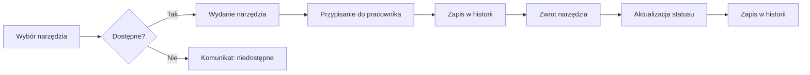

<h1 align="center">
  <br>
  <a href="https://github.com/RexEtImperator/demo-narzedziownia">
    <picture>
      
    </picture>
  </a>
  <br>
</h1>
<h3 align="center">System Zarządzania Narzędziownią</h3>
<p align="center">
  <a href="LICENSE">
    
  </a>
  <a href="https://github.com/RexEtImperator/demo-narzedziownia/releases/tag/1.0.0">
    
  </a>
    <a href="https://github.com/RexEtImperator/demo-narzedziownia/actions/workflows/ci.yml">
    
  </a>
  <a href="https://nodejs.org/en/download">
    
  </a>
</p>

## Opis projektu

System Zarządzania Narzędziownią to aplikacja webowa (frontend + API), która wspiera pełny obieg narzędzi i sprzętu BHP w firmie: ewidencję, wydania/zwroty, przeglądy oraz rozliczalność operacji.

Główne funkcje:
- Narzędzia i BHP: ewidencja, statusy, kategorie, serwis/przeglądy, terminy kontroli i oznaczenia „po terminie”.
- Wydania i zwroty: szybkie wydanie/zwrot, przypisywanie do pracowników, historia operacji i ostatnie aktywności.
- Kody i identyfikacja: generowanie/pobieranie/druk kodów QR i kreskowych, wsparcie NFC (UID) oraz wyszukiwanie po kodach/UID.
- Pracownicy i struktura: zarządzanie pracownikami, działami i stanowiskami.
- Użytkownicy i bezpieczeństwo: logowanie (JWT), role i uprawnienia (RBAC), ochrona CSRF, rate limiting wybranych operacji.
- Audyt i administracja: logi audytowe kluczowych akcji, konfiguracja aplikacji, webhooks, podgląd bazy (SQLite).
- Backup i utrzymanie: wykonywanie kopii, podgląd plików kopii i przywracanie.
- Czat real-time: WebSocket z typowaniem, załącznikami i licznikami nieprzeczytanych.
- Powiadomienia: web push (VAPID) i historia powiadomień (zależnie od konfiguracji).
- Mapa zakładu: ekran mapy zgłoszeń/awarii z kontrolą dostępu (uprawnienia).
- Kiosk / stanowisko: tryb kiosk do obsługi wydań w punkcie.
- Obsługa SSL/HTTPS dla bezpiecznej komunikacji.
- Integracja z Supabase jako alternatywne źródło danych.

## Technologie

### Frontend
- React 18 (Vite)
- Tailwind CSS
- TanStack React Query
- React Router
- React Toastify (powiadomienia)
- Recharts
- Vitest + Testing Library
- Playwright (E2E)

### Backend
- Node.js (>=22)
- Express.js (API)
- SQLite (lokalna baza danych) + opcjonalnie Supabase jako alternatywne źródło danych
- WebSocket (`ws`) dla czatu
- Swagger UI (`/api-docs`)

## Instalacja

1. Sklonuj repozytorium:
```bash
git clone https://github.com/RexEtImperator/demo-narzedziownia.git
cd demo-narzedziownia
```

2. Zainstaluj zależności: (frontend) (pamiętaj także o zainstalowaniu zależności w folderze backend node install)
```bash
npm install
```

3. Uruchom aplikację w trybie developerskim (backend + frontend):
```bash
npm run dev
```

Alternatywnie osobno:
```bash
npm run server   # backend (PORT=3000) (trzeba parę razy uruchomić aby poprawnie wrzuciło tabele, kolumny i przykładowe wiersze)
npm start        # frontend (PORT=3001)
```

### Wymagania środowiskowe
- Node.js: LTS 22.x (zalecane; projekt definiuje `"engines": { "node": ">=22 <23" }`).
- NPM: wersja `>=9`.
- Opcjonalnie: NVM do zarządzania wersją Node (`.nvmrc` wskazuje `22`).

Na Windows możesz użyć NVM for Windows:
```
nvm install 22
nvm use 22
node -v  # powinno pokazać v22.x.x
```

## Konfiguracja .env

Minimalna konfiguracja dla backendu:
- Skopiuj przykład: `copy backend\.env.example .env` (lub utwórz `.env` ręcznie w katalogu głównym).
- Ustaw co najmniej:
  - `JWT_SECRET=...` (wymagane; bez tego backend nie wystartuje)
  - `PORT=3000` (backend zawsze na 3000)
  - `ALLOWED_ORIGINS=http://localhost:8081,http://127.0.0.1:8081,http://localhost:8082,http://127.0.0.1:8082,http://localhost:3000,http://localhost:3001`

Pozostałe ważne zmienne (opcjonalne, zależnie od użycia funkcji):
- Email/SMTP:
  - `SMTP_HOST=...`
  - `SMTP_PORT=465/587`
  - `SMTP_USER=...`
  - `SMTP_PASS=...`
  - `SMTP_FROM=...`
- HTTPS dla backendu:
  - `SSL_CRT_FILE=ssl\localhost.crt`
  - `SSL_KEY_FILE=ssl\localhost.key`
- Opóźniony start:
  - `RESTART_DELAY=0`
- Web Push:
  - `VAPID_PUBLIC_KEY=...`
  - `VAPID_PRIVATE_KEY=...`

Frontend (Vite):
- Frontend zawsze działa na porcie `3001` (ustawione w `vite.config.js`).
  - `PORT=3001`
  - `HTTPS=true`
  - `SSL_CRT_FILE=ssl\localhost.crt`
  - `SSL_KEY_FILE=ssl\localhost.key`
  - `VITE_API_BASE_URL=http://localhost:3000`
- W dev domyślnie korzysta z proxy `/api -> http://localhost:3000`, więc zwykle nie trzeba ustawiać `VITE_API_BASE_URL`.
- Jeśli chcesz wymusić bazę API (np. build produkcyjny do hostowania osobno), ustaw:
  - `VITE_API_BASE_URL=http://localhost:3000`
- Jeśli używasz Supabase jako źródła danych:
  - `VITE_DB_SOURCE=supabase` (domyślnie `local`)
  - `VITE_SUPABASE_URL=...`
  - `VITE_SUPABASE_PUBLISHABLE_DEFAULT_KEY=...`

HTTPS dla frontendu (dev):
- Uruchom `npm run dev:https` (Vite z `HTTPS=true`).
- Vite próbuje użyć certyfikatów:
  - klucz: `ssl/localhost.key`
  - cert: `public/localhost.crt`

- Certyfikaty i urządzenia mobilne:
  - Wygeneruj certyfikaty: `node generate-ssl.js`

## Struktura projektu

```
├── .github/
│   └── workflows/
│       ├── ci.yml             # CI: build/test/lint
│       └── release.yml        # Publikacja wydań
├── backend/
│   ├── backups/               
│   ├── config/
│   │   ├── constants.js
│   │   ├── errorCodes.js
│   │   └── passport.js
│   ├── database/
│   │   ├── migrations/
│   │   │   ├── # pliki migracji 
│   │   ├── db.js
│   │   └── migrate.js
│   ├── helpers/
│   │   ├── audit.js
│   │   ├── auth.js
│   │   ├── crypto.js
│   │   ├── emailTemplates.js
│   │   ├── errorHelper.js
│   │   ├── fileops.js
│   │   ├── notifications.js
│   │   ├── pagination.js
│   │   ├── queryBuilder.js
│   │   ├── sanitize.js
│   │   ├── utils.js
│   │   └── webhookSender.js
│   ├── middleware/
│   │   ├── asyncHandler.js
│   │   ├── auditLogger.js
│   │   ├── auth.js
│   │   ├── cache.js
│   │   ├── csrf.js
│   │   ├── performance.js
│   │   ├── permissions.js
│   │   ├── rateLimiters.js
│   │   ├── responseHandler.js
│   │   ├── upload.js
│   │   └── validation.js
│   ├── routes/
│   │   ├── analytics.js
│   │   ├── audit.js
│   │   ├── auth.js
│   │   ├── backup.js
│   │   ├── bhp.js
│   │   ├── bhpIssues.js
│   │   ├── categories.js
│   │   ├── chat.js
│   │   ├── dashboard.js
│   │   ├── departments.js
│   │   ├── detectors.js
│   │   ├── employees.js
│   │   ├── inventory.js
│   │   ├── notifications.js
│   │   ├── plantMap.js
│   │   ├── positions.js
│   │   ├── push.js
│   │   ├── reports.js
│   │   ├── roles.js
│   │   ├── settings.js
│   │   ├── slings.js
│   │   ├── system.js
│   │   ├── toolIssues.js
│   │   ├── tools.js
│   │   ├── users.js
│   │   └── webhooks.js
│   ├── scripts/
│   │   └── sync-db.js
│   ├── services/
│   │   ├── backups/                      # Katalog kopii zapasowej bazy danych
│   │   ├── scheduler.js
│   │   ├── search.js
│   │   └── websocket.js
│   ├── .env.example
│   ├── app.js
│   ├── logger.js
│   ├── package.json                      # Backend: metadane, zależności, wersja
│   ├── server.js                         # Backend: start serwera (HTTP/HTTPS),
│   └── swagger.js
├── public/                               # Pliki statyczne frontendu
│   ├── audio/
│   │   ├── notification-error.mp3
│   │   ├── notification-get.mp3
│   │   └── notification-message.mp3
│   ├── logos/
│   │   └── logo-1767561071946.png
│   ├── equipr-nobg.png
│   ├── favicon.ico
│   ├── index.html
│   ├── localhost.crt
│   ├── login-screen-picture.png
│   ├── logo.png
│   ├── logo192.png
│   ├── logo512.png
│   ├── manifest.json
│   └── sw.js
├── scripts/                              # Skrypty pomocnicze
│   ├── report_translation_diff.cjs
│   ├── run-vitest.cjs
│   └── sync_translations_from_files.cjs
├── src/
│   ├── api/
│   │   └── supabaseMapping.js
│   ├── components/                       # Ekrany i komponenty UI
│   │   ├── bhp/
│   │   │   ├── BhpForm.jsx
│   │   │   └── BhpIssueModal.jsx
│   │   ├── common/
│   │   │   ├── EmptyState.jsx
│   │   │   ├── FilterBuilder.jsx
│   │   │   └── Toast.jsx
│   │   ├── config/
│   │   │   ├── BackupTab.jsx
│   │   │   ├── CategoriesTab.jsx
│   │   │   ├── CodesTab.jsx
│   │   │   ├── DangerZoneTab.jsx
│   │   │   ├── DatabaseTab.jsx
│   │   │   ├── DepartmentManagementScreen.jsx
│   │   │   ├── EmailTab.jsx
│   │   │   ├── FeaturesTab.jsx
│   │   │   ├── GeneralSettings.jsx
│   │   │   ├── GeneralTab.jsx
│   │   │   ├── LogoSection.jsx
│   │   │   ├── NotificationsTab.jsx
│   │   │   ├── PositionManagementScreen.jsx
│   │   │   ├── RolesPermissionsTab.jsx
│   │   │   ├── SecurityTab.jsx
│   │   │   ├── ServerTab.jsx
│   │   │   ├── SystemLogs.jsx
│   │   │   ├── TranslationsTab.jsx
│   │   │   ├── UserManagementTab.jsx
│   │   │   └── WebhooksTab.jsx
│   │   ├── employees/
│   │   │   ├── EmployeeModal.jsx
│   │   │   ├── EmployeeTooltip.jsx
│   │   │   └── EmployeesTable.jsx
│   │   ├── inventory/
│   │   │   └── InventoryReports.jsx
│   │   ├── tools/
│   │   │   ├── ToolsDetailsModal.jsx
│   │   │   ├── ToolsDetectorsEditor.jsx
│   │   │   ├── ToolsDetectorsItemsTable.jsx
│   │   │   ├── ToolsFilter.jsx
│   │   │   ├── ToolsForm.jsx
│   │   │   ├── ToolsImpactSocketsEditor.jsx
│   │   │   ├── ToolsImpactSocketsItemsTable.jsx
│   │   │   ├── ToolsIssueModal.jsx
│   │   │   ├── ToolsNotifyModal.jsx
│   │   │   ├── ToolsReturnModal.jsx
│   │   │   ├── ToolsServiceModal.jsx
│   │   │   ├── ToolsSlingsEditor.jsx
│   │   │   ├── ToolsSlingsItemsTable.jsx
│   │   │   ├── ToolsTable.jsx
│   │   │   └── ToolsTooltip.jsx
│   │   ├── AnalyticsScreen.jsx
│   │   ├── AppConfigScreen.jsx
│   │   ├── AuditLogScreen.jsx
│   │   ├── BarcodeScanner.jsx
│   │   ├── BhpScreen.jsx
│   │   ├── BottomNavigation.jsx
│   │   ├── Breadcrumbs.jsx
│   │   ├── ChatModal.jsx
│   │   ├── ChatPanel.jsx
│   │   ├── CommandPalette.jsx
│   │   ├── ConfirmationModal.jsx
│   │   ├── DashboardScreen.jsx
│   │   ├── DashboardSkeleton.jsx
│   │   ├── DbViewerScreen.jsx
│   │   ├── EmployeesScreen.jsx
│   │   ├── ErrorBoundary.jsx
│   │   ├── HelpSystem.jsx
│   │   ├── InventoryScreen.jsx
│   │   ├── KioskScreen.jsx
│   │   ├── LabelsManager.jsx
│   │   ├── LoginScreen.jsx
│   │   ├── OnboardingTour.jsx
│   │   ├── PageTransition.jsx
│   │   ├── PlantMapScreen.jsx
│   │   ├── Preloader.jsx
│   │   ├── ReportsScreen.jsx
│   │   ├── ScreenErrorBoundary.jsx
│   │   ├── Sidebar.jsx
│   │   ├── SkeletonList.jsx
│   │   ├── ToolsEditorScreen.jsx
│   │   ├── ToolsScreen.jsx
│   │   ├── TopBar.jsx
│   │   ├── UserSettingsScreen.jsx
│   │   └── index.js
│   ├── constants/                        # Stałe aplikacji rozbite o audyt
│   │   └── auditActions.js
│   ├── contexts/                         # Konteksty aplikacji (język, motyw)
│   │   ├── LanguageContext.jsx
│   │   └── ThemeContext.jsx
│   ├── hooks/                            # Hooki domenowe (narzędzia, BHP, dashboard, auth)
│   │   ├── useAppConfig.js
│   │   ├── useAppData.js
│   │   ├── useAppNavigation.js
│   │   ├── useAuth.js
│   │   ├── useBhp.js
│   │   ├── useDashboardStats.js
│   │   ├── useDepartments.js
│   │   ├── useEmployeeIssuedItems.js
│   │   ├── useEmployeeManagement.js
│   │   ├── useEmployees.js
│   │   ├── useIssuedTools.js
│   │   ├── usePositions.js
│   │   ├── useSidebarCounts.js
│   │   ├── useTools.js
│   │   ├── useToolsManagement.js
│   │   └── useWeldingInspectionNotifications.js
│   ├── i18n/                             # Pliki tłumaczeń bazowych (PL/EN/DE/CZ)
│   │   ├── cz.json
│   │   ├── de.json
│   │   ├── en.json
│   │   └── pl.json
│   ├── services/
│   │   └── errorTracking.js
│   ├── utils/                            # Narzędzia (formatowanie dat, eksporty, walidatory)
│   │   ├── auditLogger.js
│   │   ├── bhpExport.js
│   │   ├── dateUtils.js
│   │   ├── employeesExport.js
│   │   ├── indexedDB.js
│   │   ├── notify.jsx
│   │   ├── pushUtils.js
│   │   ├── sanitize.js
│   │   ├── statusUtils.js
│   │   ├── supabase.js
│   │   ├── toolsExport.js
│   │   └── validators.js
│   ├── App.jsx                           # Główny komponent aplikacji
│   ├── api.js                            # Klient HTTP do API
│   ├── constants.js                      # Stałe aplikacji
│   ├── index.css                         # Style globalne
│   ├── index.jsx                         # Punkt wejścia
│   └── setupProxy.js
├── ssl/                                  # Klucze/certyfikaty lokalne
│   ├── localhost.crt
│   └── localhost.key
├── .env.example
├── .eslintrc.json
├── .gitignore
├── CHANGELOG.md
├── LICENSE
├── README.md
├── app.js
├── ecosystem.config.js
├── eslint.config.js
├── generate-ssl.js
├── index.html
├── package.json
├── package-lock.json
├── playwright.config.js
├── postcss.config.cjs
├── tailwind.config.js                    # Konfiguracja Tailwind CSS
├── vite.config.js                        # Konfiguracja Vite (proxy, HTTPS, plugin React)
└── vitest.backend.config.js
```

Kluczowe zasady:
- Frontend działa z katalogu `src/` i używa kontekstów `LanguageContext` oraz `ThemeContext`.
- Tłumaczenia bazowe są w `src/i18n/*.json`, a nadpisania pochodzą z bazy i są ładowane przez backend.
- Backend startuje z `server.js` i udostępnia API (w tym administracyjną obsługę tłumaczeń).

## Jak uruchomić

- Dev (backend + frontend):
  - `npm run dev`
  - Backend: `http://localhost:3000` (uruchamiany przez `npm run server`, wejście: `backend/server.js`)
  - Frontend: `http://localhost:3001` (proxy do `/api` -> `http://localhost:3000`)
  - Dev z HTTPS (frontend): `npm run dev:https` (Vite z `HTTPS=true`)
  - Tylko backend: `npm run server` (uruchamia `node backend/server.js`)
  - Tylko frontend: `npm start`
  - Build produkcyjny frontendu: `npm run build` (wynik w katalogu `dist/`)

## Deployment lokalny

- Docker (zalecane do uruchomień „na gotowo”):
  - `docker compose up --build`
  - Backend: `http://localhost:3000`
  - Frontend (Nginx): `http://localhost:3001`

- Bez Dockera (frontend hostowany osobno):
  - Zbuduj frontend: `npm run build` (katalog `dist/`)
  - Hostuj `dist/` dowolnym serwerem statycznym (np. Nginx) i ustaw `VITE_API_BASE_URL=http://localhost:3000` jeśli nie korzystasz z proxy.

## Funkcjonalności

### Analityka
- W pełni zlokalizowane nagłówki, komunikaty, chipy i stany widoku.
- Eksport serwisu narzędzi do PDF/XLSX z tłumaczonymi tytułami, nagłówkami i nazwami plików.
- Daty w eksporcie formatowane zgodnie z wybranym językiem (locale PL/EN/DE).
- Informacje o uprawnieniach i brakach danych prezentowane w języku użytkownika.

### Konfiguracja aplikacji
- Pionowe zakładki z lewym panelem nawigacyjnym i treścią po prawej
- Sticky lewy panel na wysokich ekranach
- Dynamiczny nagłówek sekcji po prawej (ikona + nazwa aktywnej zakładki)
- Spójne style i placeholdery w modalach

Endpointy backendu (i18n):
- `GET /api/translations/:lang` — publiczny, zwraca mapę tłumaczeń dla danego języka (`{ translations: { key: value } }`).
- `GET /api/translate` — administracyjny (wymaga `SYSTEM_SETTINGS`), filtrowanie i podgląd tłumaczeń.
- `PUT /api/translate/bulk` — administracyjny (wymaga `SYSTEM_SETTINGS`), masowa aktualizacja tłumaczeń.

Inicjalizacja bazy:
- Przy pierwszym uruchomieniu po dodaniu funkcji, tabela `translate` jest tworzona i automatycznie wypełniana kluczami z `pl.json`, `en.json`, `de.json`, `cz.json`. Jeśli nie użyj komendy `npm run i18n:sync`.
- Jeśli backend działał wcześniej, zrestartuj go po aktualizacji, aby utworzyć tabelę i wykonać seed.

Uwagi techniczne:
- `LanguageContext` pobiera nadpisania przez `GET /api/translations/:lang` i stosuje je w funkcji `t()`.
- Błędy użycia `useTheme` poza `ThemeProvider` są tłumaczone kluczem `Theme.useThemeProvider`.
- `src/utils/dateUtils.js` formatuje daty i komunikaty relative time w `PL/EN/DE/CZ` (pluralizacja PL, locale `pl-PL/en-GB/de-DE/cz-CZ`).

### Dashboard
- Przegląd statystyk narzędzi i pracowników
- Szybkie wydanie i zwrot
- Historia ostatnich aktywności

## Diagram procesu wydania/zwrotu



### Zarządzanie narzędziami
- Dodawanie nowych narzędzi
- Edycja istniejących narzędzi
- Śledzenie statusu (dostępne/wydane/serwis)
- Historia wydań i zwrotów

### Zarządzanie sprzętem BHP
- Dodawanie nowych sprzętów
- Edycja istniejących pozycji
- Terminy przeglądów danego sprzętu z przypomnieniem i oznaczeniem 'Po terminie'
- Śledzenie statusu (dostępne/wydane/wydane na stałe)
- Możliwość wydawania sprzętu "na stałe" (checkbox przy wydaniu)
- Historia wydań i zwrotów

### Zarządzanie pracownikami
- Dodawanie nowych pracowników
- Przypisywanie działu i stanowiska

### System wydań
- Proces wydania i zwrotu narzędzi/sprzętu BHP
- Weryfikacja dostępności, historia operacji

### Logowanie i uprawnienia
- Logowanie z użyciem JWT
- Role i uprawnienia (RBAC), kontrola dostępu do akcji i ekranów
- Warunkowe wyświetlanie elementów UI na podstawie uprawnień
- Zarządzanie uprawnieniami w `PermissionsModal` dostępne także jako osobna trasa: `/permissions` (wymaga `SYSTEM_SETTINGS`).

### Działy i stanowiska
- Zarządzanie strukturą organizacyjną: działy i stanowiska
- Przypisanie działu do stanowiska
- Przypisanie stanowisk do pracowników

### BHP (przeglądy)
- Przeglądy BHP narzędzi, terminy i przypomnienia
- Usprawnienia sortowania „Najbliższy/Najdalszy”

### Audyt (logi)
- Rejestrowanie istotnych akcji i nawigacji po ekranach
- Wgląd w historię działań użytkowników

### Skaner kodów
- Skanowanie kodów QR i kreskowych (kamera urządzenia)
- Generowanie i wykorzystanie kodów w procesach wydań
- Zlokalizowane komunikaty o zgodności przeglądarki, dostępie do kamery i stanie skanowania.
- Wskazówki skanowania dostosowane językowo; obsługa latarki (torch) tam gdzie wspierane.
- Czytelne komunikaty przy odmowie uprawnień kamery oraz bezpieczne wyłączenie strumienia.

### Konfiguracja / Backup
- Podgląd ostatniej kopii zapasowej i listy plików
- Akcja „Wykonaj kopię” z poziomu UI

### Ustawienia użytkownika
- Preferencje interfejsu, tryb ciemny
- Spójne style i zachowanie modalnych okien

### Powiadomienia
- Toasty informacyjne/sukcesu/błędu dla operacji (React Toastify)
- Globalna konfiguracja: `ToastContainer` z `autoClose=2500ms`, ukrytym paskiem postępu, motywem `colored` i spójnym stylem.
- Ujednolicone helpery na ekranie „Konfiguracja” (`notifySuccess`/`notifyError`).

### Czat (real-time)
- WebSocket: połączenie pod `wss://<host>/api/chat/ws?token=<JWT>` (wymagana autoryzacja JWT).
- Typy wiadomości: `chat:message`, `chat:typing`, `chat:heartbeat` (podtrzymanie połączenia i wykrywanie aktywności).
- API konwersacji i wiadomości:
  - `GET /api/chat/conversations`, `POST /api/chat/conversations` (tworzenie 1:1/grup).
  - `GET /api/chat/conversations/:id/messages`, `POST /api/chat/conversations/:id/messages`.
  - `POST /api/chat/conversations/:id/messages/attachments` (maks. 6 plików na wiadomość).
  - `GET /api/chat/unread-count` (liczba nieprzeczytanych), `GET /api/chat/conversations/:id/typing-history`.
  - `POST /api/chat/conversations/:id/read` / `:id/unread`, `POST /api/chat/conversations/:id/block`, `DELETE /api/chat/conversations/:id`.
- Załączniki serwowane spod `GET /chat_attachments/<filename>`.
- Konfiguracja: flaga `enableRealtimeChat` w `app_config` (Konfiguracja → Ogólne).

### Języki (i18n)
- Obsługa wielu języków interfejsu: polski (`pl`), angielski (`en`) i niemiecki (`de`).
- Kontekst języka: `src/contexts/LanguageContext.jsx` z metodą `t(key, params)` i wyborem języka.
- Słowniki: `src/i18n/pl.json`, `src/i18n/en.json`, `src/i18n/de.json` — dodawaj nowe klucze według konwencji kropkowej.
- Zakładka „Tłumaczenie” pozwala edytować tłumaczenia dla języków `PL/EN/DE`.
- Przełącznik języka na górze (PL/EN/DE) — edycja dotyczy tylko wybranego języka.
- Wyszukiwanie po kluczu, szybkie edytowanie i zapis zmian (`Zapisz zmiany`).
- Dodawanie nowych tłumaczeń przez „Dodaj tłumaczenie” (modal: pola `Klucz`, `PL`, `EN`, `DE`, `CZ`).
- Walidacja kolizji klucza — ostrzeżenie i zablokowanie dodania, jeśli klucz już istnieje.
- Tłumaczenia są przechowywane w tabeli bazy danych `translate`; nadpisują wartości z plików `src/i18n/*.json`.
- Frontend ładuje nadpisania dla aktywnego języka i stosuje je w `t()` (priorytet: baza → plik).

### Prefiksy kodów
- Prefiks dla narzędzi (`toolsCodePrefix`).
- Prefiksy per kategoria narzędzia (`toolCategoryPrefixes`).
- Logika w UI: prefiks kategorii ma pierwszeństwo nad prefiksem narzędzi.

### API — endpoint sugestii (Elektronarzędzia)
- `GET /api/tools/suggestions?category=Elektronarzędzia`
  - Zwraca:
    - `manufacturers`: tablica unikalnych producentów
    - `models`: tablica unikalnych modeli
    - `years`: tablica unikalnych lat produkcji (liczby)
  - Przykład odpowiedzi:
    ```json
    {
      "manufacturers": ["Bosch", "Makita"],
      "models": ["GSR 12V", "DHP482"],
      "years": [2020, 2021, 2022]
    }
    ```

## Testy i jakość
- Lint: `npm run lint`.
- Testy jednostkowe (Vitest): `npm test` (CI: `npm run test:ci`).
- E2E (Playwright): `npx playwright test`.

## Changelog

Zmiany wersji są opisane w pliku [CHANGELOG.md](CHANGELOG.md).

## Licencja

Projekt jest licencjonowany na zasadach MIT.
Copyright (C) 2025-2026 Dawid Brzezinski

Szczegóły licencji znajdziesz w pliku [LICENSE](LICENSE).
